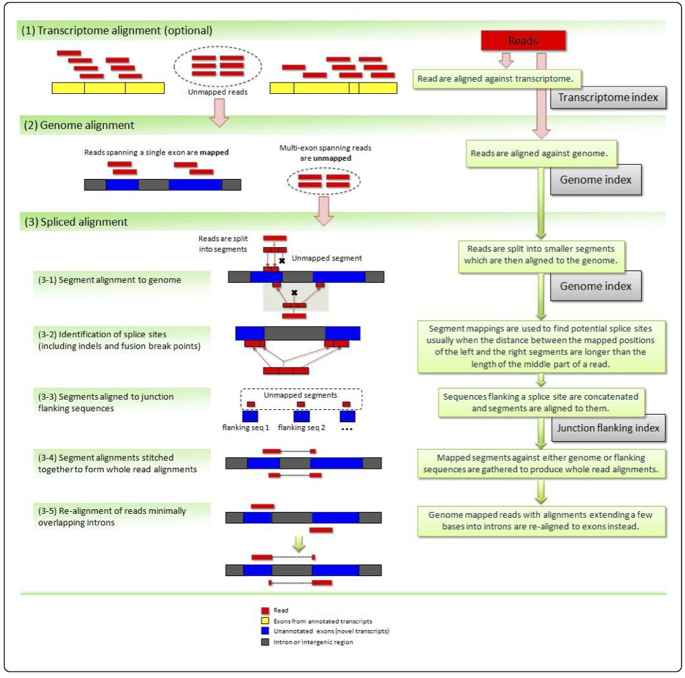

# Introduction to Alignment with TopHat 

[TopHat](https://ccb.jhu.edu/software/tophat/index.shtml) is a fast splice junction mapper for RNA-Seq reads that uses [Bowtie](http://bowtie-bio.sourceforge.net/index.shtml) underneath the hood to perform memory-efficient short read alignments. Though it has been somewhat superseded by [HISAT2](http://ccb.jhu.edu/software/hisat2/index.shtml) (developed by the same group - the [Center for Computational Biology](http://ccb.jhu.edu) at Johns Hopkins University), it is still a vital component in many different sequence analysis pipelines and thus plays an important role in the bioinformatics toolkit. 

## Why TopHat?

There are a variety of different sequence mappers to use for RNA-seq data (such as Bowtie/BWA), so why use TopHat? One reason: [splicing](https://en.wikipedia.org/wiki/Alternative_splicing). Many (such as the two above) mapping software packages do not take splicing into account when they map reads, and as such may be inappropriate for a given task and a given set of data. TopHat, being a spliced read aligner **and** being relatively easy to use, thus fills a critical role when one needs to align RNA-seq reads to a reference genome and map reads over exon/intron junctions. Additionally, TopHat works at the **transcriptome** level, whereas other tools (such as Bowtie) work at the **genome** level. 

## How it Works

<kbd>
  
 </kbd>
 
